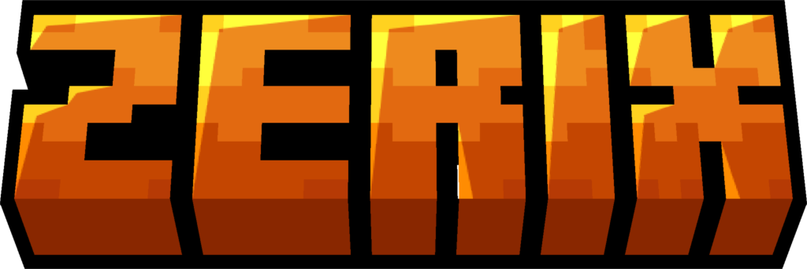

<p align="center">
  
</p>

<h1 align="center">Bridger</h1>

<p align="center"><strong>by Zerix Network</strong></p>

<p align="center">
  
</p>

<p align="center">
  Convert Minecraft worlds and resource packs between Java Edition and Bedrock Edition, and preview schematic files locally.
</p>

<p align="center">
  <a href="https://github.com/ZerixNetwork/Bridger/releases">Releases</a> ·
  <a href="https://github.com/ZerixNetwork/Bridger/issues">Issues</a> ·
  <a href="https://discord.gg/Jsnpvu7S5e">Discord</a> ·
  <a href="LICENSE">License</a>
</p>

> [!WARNING]
> Bridger is under active development. Back up important worlds before converting them.

## About

Bridger is a community-maintained fork of [Hive Games' Chunker](https://github.com/HiveGamesOSS/Chunker), developed by Zerix Network. It keeps the original Java/Bedrock world converter and adds a schematic viewer to the desktop interface.

The project was started by **SuperDoduos** for Zerix Network after needing a quicker way to inspect schematic map files before importing them into Minecraft.

## Features

- Convert complete worlds between supported Java and Bedrock versions.
- Upgrade or downgrade worlds between supported game versions.
- Convert common block and item textures between Java and Bedrock resource packs.
- Select source and target Minecraft versions when converting resource packs.
- Use either the Electron desktop interface or Java CLI.
- Preview `.schematic`, `.schem`, `.nbt` and `.mcstructure` files without converting them.
- Switch schematic previews between textured 3D, 2D top view and individual layers.
- Load bundled Minecraft textures or a custom Java resource pack in the 3D viewer.
- Explore 3D previews with mouse controls, WASD movement and fullscreen mode.
- Configure block mappings, dimensions, pruning and other conversion settings.

> [!NOTE]
> The schematic feature is a viewer only. It does not currently convert schematic files into worlds or other formats.

> [!WARNING]
> Resource pack conversion is currently in alpha. Common block and item textures are mapped automatically, but models, animations, sounds, definitions and UI layouts may require manual fixes. Unmapped files are preserved inside the output archive.

## Supported world versions

<details>
<summary><strong>Bedrock Edition</strong></summary>

- 1.12.0
- 1.13.0
- 1.14.0–1.14.60
- 1.16.0–1.16.220
- 1.17.0–1.17.40
- 1.18.0–1.18.30
- 1.19.0–1.19.80
- 1.20.0–1.20.80
- 1.21.0–1.21.130
- 1.26.0–1.26.30

</details>

<details>
<summary><strong>Java Edition</strong></summary>

- 1.8.8
- 1.9.0–1.9.3
- 1.10.0–1.10.2
- 1.11.0–1.11.2
- 1.12.0–1.12.2
- 1.13.0–1.13.2
- 1.14.0–1.14.4
- 1.15.0–1.15.2
- 1.16.0–1.16.5
- 1.17.0–1.17.1
- 1.18.0–1.18.2
- 1.19.0–1.19.4
- 1.20.0–1.20.6
- 1.21.0–1.21.11
- 26.1–26.2

</details>

## Building

### Requirements

- Git
- Java 17 or newer

Node.js and npm are downloaded by the included Gradle tasks when required.

```bash
git clone https://github.com/ZerixNetwork/Bridger.git
cd Bridger
```

Build everything on Linux or macOS:

```bash
./gradlew build
```

Build everything on Windows:

```powershell
.\gradlew.bat build
```

Useful targeted commands:

| Purpose | Linux/macOS | Windows |
| --- | --- | --- |
| Start the desktop app in development | `./gradlew app:start` | `.\gradlew.bat app:start` |
| Package the desktop app | `./gradlew app:build` | `.\gradlew.bat app:build` |
| Build the CLI | `./gradlew cli:build` | `.\gradlew.bat cli:build` |
| Run tests | `./gradlew cli:test` | `.\gradlew.bat cli:test` |

Generated artifacts are written under `build/libs/`, `cli/build/libs/` and `app/electron/dist/`, depending on the selected task.

## CLI

After building the CLI:

```bash
java -jar cli/build/libs/chunker-cli-VERSION.jar \
  --inputDirectory "my_world" \
  --outputFormat BEDROCK_R20_80 \
  --outputDirectory "output"
```

Required options:

| Short | Long | Description |
| --- | --- | --- |
| `-i` | `--inputDirectory` | World directory to read. |
| `-f` | `--outputFormat` | Target format, such as `JAVA_1_20_5` or `BEDROCK_R20_80`. |
| `-o` | `--outputDirectory` | Directory where the converted world is written. |

Run the JAR with `--help` to see all available mapping and converter options.

The desktop application normally allows the backing JVM to use up to 75% of available memory. Memory and other JVM options can be passed when launching it:

```powershell
Bridger.exe -Xmx8G
Bridger.exe --java-options="-Xms2G -Xmx8G"
```

## Current limitations

World conversion has limited or no support for:

- most entities, apart from supported cases such as paintings and item frames;
- generated structure data such as villages and strongholds;
- custom or third-party data without an equivalent in the target edition.

Large schematic previews can require significant memory or graphics resources. The viewer warns before rendering files above its normal safe volume and limits a 3D preview to 250,000 visible blocks.

Resource pack conversion currently focuses on common vanilla texture paths and filenames. It does not guarantee complete conversion of custom models, shaders, animations, sounds or edition-specific UI files.

## Contributing

Issues and contributions are welcome. Include the source edition/version, target edition/version, reproduction steps and relevant logs when reporting conversion problems.

Please do not commit API keys, private data, world files you cannot redistribute or copyrighted game assets without permission.

## Credits

Bridger is maintained by **Zerix Network** and was founded by **SuperDoduos**.

It is based on [Chunker](https://github.com/HiveGamesOSS/Chunker), created by Hive Games and its contributors. The project also retains Chunker's [LevelDB implementation](https://github.com/HiveGamesOSS/leveldb-mcpe-java/) and original [dependency graph](https://github.com/HiveGamesOSS/Chunker/network/dependencies).

Resource pack texture mappings include data derived from [GeyserMC PackConverter](https://github.com/GeyserMC/PackConverter). See [third-party notices](THIRD_PARTY_NOTICES.md) for its MIT license notice.

## Minecraft textures

The build prepares block textures from Mojang's official Minecraft client for use only inside the schematic preview. Users may also select a compatible custom resource pack locally.

Minecraft textures and other game assets are not covered by this repository's MIT License. Minecraft is a trademark of Microsoft Corporation. Bridger is not affiliated with or endorsed by Mojang Studios or Microsoft.

## License

The software is distributed under the [MIT License](LICENSE). The original Hive Games copyright and permission notice must remain included in copies or substantial portions of the software.

Bridger is an independent Zerix Network fork and is not affiliated with or endorsed by Hive Games.
